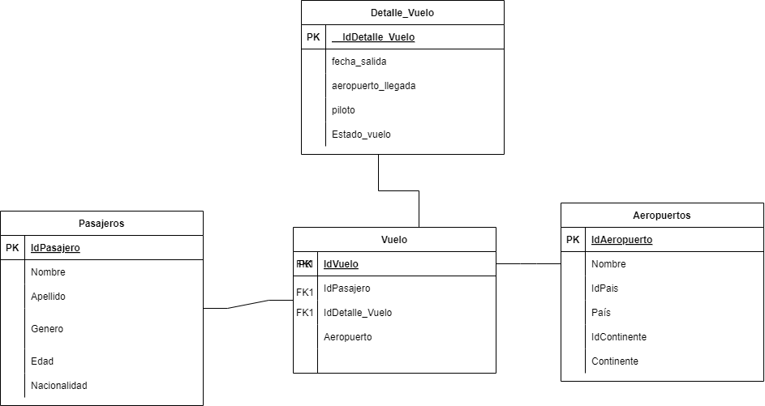

# -SS2-Practica1_201901055
Practica 1 de Seminario de Sistemas 2 

# Manual Técnico


## Modelo de Datos

### Tablas de Hechos

**Vuelos**

La tabla Vuelos es la tabla de hechos en este modelo. Contiene las relaciones entre los pasajeros, los aeropuertos, y los detalles de vuelo. Cada registro en esta tabla representa un vuelo individual que un pasajero ha tomado.

**Campos principales:**
- IdVuelo: Identificador único del vuelo.
- IdPasajero: Llave foránea que referencia a la tabla Pasajeros.
- IdAeropuerto: Llave foránea que referencia a la tabla Aeropuertos.
- IdDetalle_Vuelo: Llave foránea que referencia a la tabla Detalle_Vuelo.

### Tablas de Dimensiones

**Pasajeros**

Esta tabla almacena la información básica de los pasajeros que han viajado.

**Campos principales:**
- IdPasajero: Identificador único del pasajero.
- Nombre: Nombre del pasajero.
- Apellido: Apellido del pasajero.
- Genero: Género del pasajero.
- Edad: Edad del pasajero.
- Nacionalidad: Nacionalidad del pasajero.

**Aeropuertos**

Esta tabla contiene información sobre los aeropuertos involucrados en los vuelos.

**Campos principales:**
- IdAeropuerto: Identificador único del aeropuerto.
- Nombre: Nombre del aeropuerto.
- IdPais: Llave foránea que referencia a la tabla Pais.
- Pais: Nombre del país donde se encuentra el aeropuerto.
- IdContinente: Llave foránea que referencia a la tabla Continentes.
- Continente: Nombre del continente donde se encuentra el aeropuerto.

**Detalle_Vuelo**

Esta tabla proporciona detalles adicionales sobre los vuelos, como la fecha de salida, el aeropuerto de llegada, y el piloto del vuelo.

**Campos principales:**
- IdDetalle_Vuelo: Identificador único del detalle del vuelo.
- fecha_salida: Fecha de salida del vuelo.
- aeropuerto_llegada: Nombre del aeropuerto de llegada.
- piloto: Nombre del piloto encargado del vuelo.
- Estado_vuelo: Estado del vuelo (por ejemplo, en curso, completado, cancelado).


### Modelo



---

## Uso del Modelo Estrella en Data Warehouse

El modelo estrella fue seleccionado para este Data Warehouse debido a su simplicidad y eficiencia en la ejecución de consultas, organizando los datos en torno a una tabla de hechos central conectada a múltiples tablas de dimensiones. Este enfoque facilita la rápida ejecución de consultas complejas, permite un entendimiento simple de la estructura por parte de los usuarios, ofrece escalabilidad al sistema, optimiza el procesamiento analítico en línea (OLAP) y mejora la eficiencia en el almacenamiento al reducir la redundancia de datos sin comprometer la velocidad de las consultas.


---


# Inicialización del Proyecto

1. Clona el repositorio en tu máquina local
```
git clone <URL_DEL_REPOSITORIO>
```
2. Accede a la carpeta del proyecto
```
cd <NOMBRE_DEL_REPOSITORIO>
```
3. Crea un entorno virtual:
```
python -m venv env
```
4. Activa el entorno virtual:
- En Windows:
```
env\Scripts\activate
```
- En macOS/Linux:
```
source env/bin/activate
```

5. Instala las dependencias necesarias:
```
pip install -r requirements.txt
```

### Ejecutar
python .\main.py
